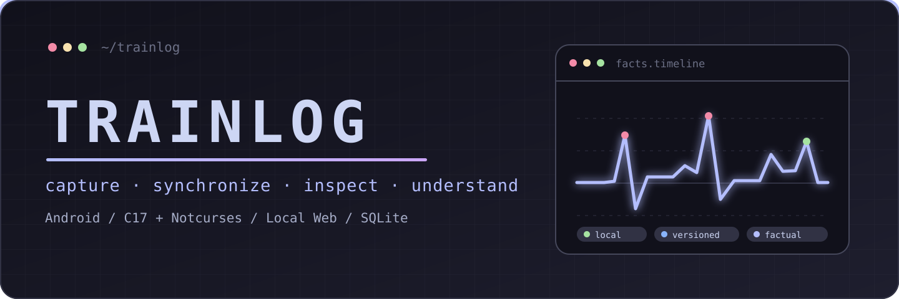
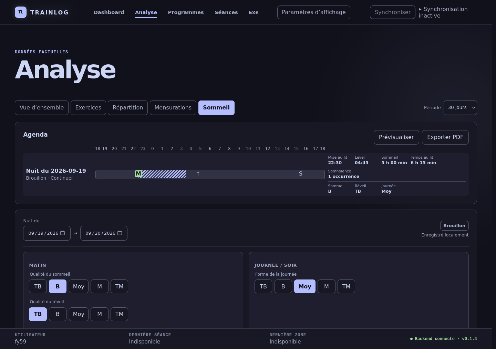

<p align="center">
  
</p>

<p align="center">
  
</p>

Trainlog is a **local-first system for recording, synchronizing, and examining
training and body data**. Its Android companion handles capture in the field;
the C17 desktop core keeps the canonical long-term history; a keyboard-first
Notcurses TUI and a loopback-only Web application provide complementary ways
to inspect and manage it.

The system is built around explicit facts, stable identities, versioned JSON
exchanges, and user-controlled storage. Plans never become performed work until
they are actually recorded, continuous activities are not disguised as sets,
and estimates are kept distinct from measurements.

> **Release line:** The latest stable release is
> [`v0.1.6`](https://github.com/labfytools/trainlog/releases/tag/v0.1.6).

## ✦ Showcase

<p align="center">
  
</p>

<p align="center"><sub>Web Analyse in Trainlog 0.1.6 — synchronized Sleep facts and measured heart-rate data on one timeline.</sub></p>

The repository currently tracks real-browser evidence for the Web interface.
Its Android overview asset is a clearly labelled static design study with
fictional data, not a runtime screenshot; no current TUI screenshot is tracked.
Those assets are therefore not presented here as product captures.

## ✦ Features

| Area                 | Available in the current development tree                                                                                                                                                     |
| -------------------- | --------------------------------------------------------------------------------------------------------------------------------------------------------------------------------------------- |
| **Training capture** | Metadata-driven sets, repetitions, durations and continuous activities; heterogeneous actual sets; durable active draft; exercise timelines; explicit measured MAX results.                   |
| **Planning**         | Manual preparations, imported Programs, Android delivery, execution provenance and strict separation between targets and facts.                                                               |
| **Context**          | Exercise and equipment catalogues, BODY ZONES, body measurements, immediate feedback, wording revisions and J+1 follow-ups.                                                                   |
| **Cardio**           | Android BLE heart-rate acquisition, factual BPM/RR history, cardio sessions, measured calibration and fresh-signal phase guidance.                                                            |
| **Sleep**            | One-tap Android capture, causal Sleep Diary revisions, medication occurrences, synchronized factual timelines and local vector PDF export.                                                    |
| **Desktop**          | C17 Core, canonical SQLite history, keyboard-first Notcurses administration, correction, statistics, graphs and synchronization diagnostics.                                                  |
| **Local Web**        | Loopback-only Dashboard, Analyse, Programmes, Sessions, Exercises, Equipment, Settings and synchronization surfaces backed by typed Core services.                                            |
| **Synchronization**  | One generation/ACK business engine over authenticated Bluetooth Classic RFCOMM, direct USB/MTP recovery and a separately configured private Drive workflow; SQLite files are never exchanged. |

### Boundaries and work in progress

- `TRAINLOG_FORMAT_V1` remains frozen. The active mobile snapshot is V3; V1
  and V2 remain readable, while V4 codecs are staged but not selected by the
  active transport.
- Full-generation synchronization is deployed only behind a trusted local
  opt-in; the default automatic exchange remains V3.
- AI history export is active. AI session proposals still have a pending real
  Drive plus Android-triggered bidirectional smoke test.
- Session Generator V1 is implemented but hidden while the V2 planning model
  is developed.
- Web Analyse is implemented; its recorded visual-review gate remains open.

The canonical status and limitations live in
[`docs/current_state.md`](docs/current_state.md); future work belongs in the
[`roadmap`](docs/roadmap.md).

## ✦ Architecture

```text
┌──────────────────────────────┐
│ Android field companion      │
│ private SQLite capture store │
└──────────────┬───────────────┘
               │ versioned JSON generations + acknowledgements
               │ Bluetooth RFCOMM primary · direct USB/MTP recovery
               ▼
┌──────────────────────────────┐       optional, separately configured
│ Synchronization orchestration│◄───── private Drive workflow
└──────────────┬───────────────┘
               │ typed imports, commands and read models
               ▼
┌──────────────────────────────┐
│ Trainlog Core · C17          │
│ desktop SQLite = canonical   │
│ long-term history            │
└──────────────┬───────────────┘
               │
        ┌──────┴──────────┐
        ▼                 ▼
┌──────────────┐   ┌──────────────────────┐
│ Notcurses TUI│   │ 127.0.0.1 Web adapter│──► browser
└──────────────┘   └──────────────────────┘
```

The TUI, Web application, and Android client are sibling adapters with
different responsibilities. Business rules, calculations, persistence, and
typed read models belong to Core; presentation code does not reconstruct them
from raw database tables. See the full
[`architecture contract`](docs/architecture.md).

## ✦ Your data, your system

- Trainlog runs on the user's own Android and Linux systems; no hosted Trainlog
  account or proprietary cloud service is required for core capture, history,
  analytics, or direct synchronization.
- Android and desktop each keep a local SQLite database; the desktop database
  is the canonical long-term history.
- Devices exchange bounded, versioned JSON artifacts—not database files.
- The local Web server binds to `127.0.0.1` by default and never silently falls
  back to a LAN address or another port.
- Direct Android storage uses `Documents/Trainlog`; desktop USB access uses
  `libudev` and `libmtp` without requiring a GVFS/FUSE mount.
- The optional Drive path is operator-configured through external `rclone`.
  Android holds no cloud credentials.

## ✦ Build and run

### Desktop and TUI

The desktop build requires Meson, Ninja, a C17 toolchain, `pkg-config`, Python
3, and development files for SQLite, libuuid, utf8proc, libudev, libmtp,
Notcurses Core, GNU libmicrohttpd, and yyjson.

```bash
meson setup build
meson compile -C build
meson test -C build --print-errorlogs
./build/tui/trainlog
```

The desktop database is stored at
`$XDG_DATA_HOME/trainlog/trainlog.db`, or
`~/.local/share/trainlog/trainlog.db` when `XDG_DATA_HOME` is unset.

### Embedded local Web application

Node and npm are build-time dependencies only. Meson does not download npm
packages.

```bash
cd web
npm ci
npm run typecheck
npm test
cd ..

meson setup build-web -Dweb=enabled
meson compile -C build-web
./build-web/tui/trainlog --web
```

The Web application listens on `127.0.0.1:8080` by default. Use
`--port <port>` for an explicit alternative. For an existing build directory,
use `meson configure build -Dweb=enabled` instead of running `meson setup`
again.

### Android

Android builds use the committed Gradle wrapper, JDK 17, and an Android SDK for
the configured API levels (`minSdk 26`, `targetSdk 36`, `compileSdk 37`).

```bash
cd android
JAVA_HOME=/usr/lib/jvm/java-17-openjdk ./gradlew test
JAVA_HOME=/usr/lib/jvm/java-17-openjdk ./gradlew assembleDebug
```

Instrumented tests belong on an emulator; the primary personal phone is
reserved for manual, non-destructive installation and synchronization checks.
Release APK signing is intentionally operator-local and is not configured with
credentials from this repository.

<details>
<summary>Optional user-session services</summary>

After a desktop build, the repository provides an installer for the private
automatic synchronization services:

```bash
bash tools/install_syncd_user.sh
systemctl --user is-active trainlog-syncd.service
```

This modifies the current user's `~/.local/bin` and systemd user configuration.
Bluetooth generation transport starts only when its separate Trainlog
configuration explicitly enables it. The loopback Web development unit in
`systemd/trainlog-web.service` is another optional integration; neither service
is required for manual TUI use.

</details>

Prebuilt stable APKs and Linux x86-64 runtime bundles are published on both
official mirrors: [Forgejo Releases](https://git.labfytools.com/fy59/trainlog/releases)
and [GitHub Releases](https://github.com/labfytools/trainlog/releases). Verify
downloaded artifacts against the accompanying `SHA256SUMS`.

## ✦ Repository layout

```text
trainlog/
├── android/          Kotlin + Jetpack Compose field companion
├── tui/              C17 Core, Notcurses TUI, Web adapter and native tests
├── web/              React + TypeScript + Vite frontend
├── catalog/          versioned scientific and product knowledge
├── format/           JSON schemas and frozen format material
├── contracts/        machine-readable presentation contracts
├── tools/            validators, import/export and sync utilities
├── tests/            cross-surface and protocol regression tests
├── systemd/          optional user-session integration
└── docs/             canonical documentation and review evidence
```

## ✦ Documentation

| Start here                                                   | Scope                                                                           |
| ------------------------------------------------------------ | ------------------------------------------------------------------------------- |
| [`docs/current_state.md`](docs/current_state.md)             | Implemented capabilities, versions, validation evidence and active limitations. |
| [`docs/architecture.md`](docs/architecture.md)               | Component, storage, process, transport and ownership boundaries.                |
| [`docs/roadmap.md`](docs/roadmap.md)                         | Current cursor and future work.                                                 |
| [`docs/android.md`](docs/android.md)                         | Android capture, persistence and synchronization behavior.                      |
| [`docs/tui.md`](docs/tui.md)                                 | Notcurses workflows, correction, analytics and technical tools.                 |
| [`docs/sync_exchange.md`](docs/sync_exchange.md)             | Active synchronization flow, replay and acknowledgement semantics.              |
| [`docs/exchange_format.md`](docs/exchange_format.md)         | Frozen and separately versioned JSON contracts.                                 |
| [`docs/exercise_data_model.md`](docs/exercise_data_model.md) | Exercise, occurrence, planning, load and MAX semantics.                         |
| [`docs/database.md`](docs/database.md)                       | Desktop SQLite schema and migration contracts.                                  |
| [`docs/tests.md`](docs/tests.md)                             | Canonical validation commands and coverage strategy.                            |

The complete ownership map is in [`docs/README.md`](docs/README.md), with
chronological detail in the [`CHANGELOG`](CHANGELOG.md).

## ✦ Project status

| Boundary            | Current state                                                                                             |
| ------------------- | --------------------------------------------------------------------------------------------------------- |
| Product             | `0.1.6` stable                                                                                            |
| Desktop persistence | SQLite schema v36                                                                                         |
| Android persistence | SQLite schema v33                                                                                         |
| Mobile exchange     | V3 active; V1/V2 readable; V4 staged only                                                                 |
| Desktop terminal    | C17 + Notcurses, active backend                                                                           |
| Local Web           | Dashboard and operational Analyse, Programmes, Sessions, Exercises, Equipment, Settings and sync surfaces |
| Interface language  | French by default; English selectable on Android and desktop                                              |
| Compatibility       | `TRAINLOG_FORMAT_V1=PASS/FROZEN`                                                                          |

Forgejo is the primary repository; GitHub is its release mirror. Trainlog is
licensed under the [GNU General Public License v3](LICENSE).
